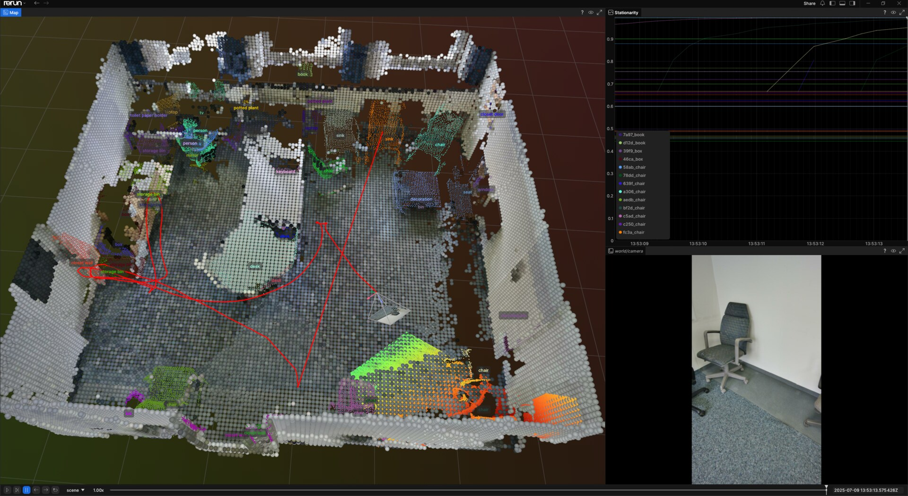
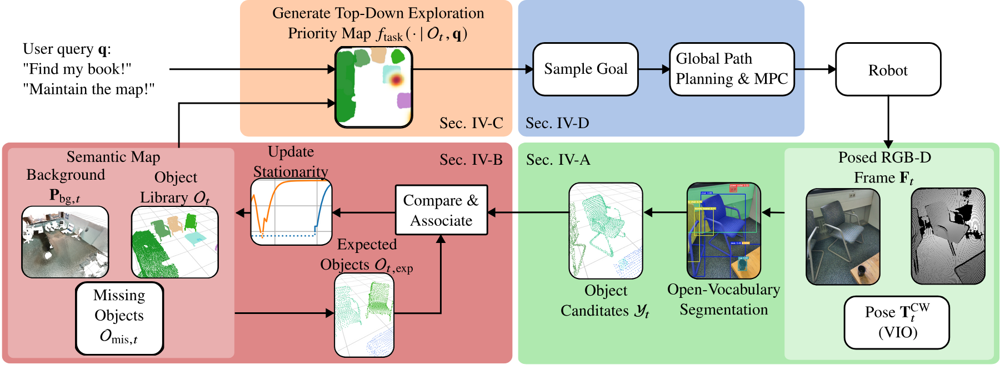

# Where Did I Leave My Glasses? Open-Vocabulary Semantic Exploration in Real-World Semi-Static Environments

[Benjamin Bogenberger](https://ben-bogenberger.de/)<sup>1</sup>,
[Oliver Harrison](https://oliverharrison.vercel.app/)<sup>1</sup>,
Orrin Dahanaggamaarachchi<sup>1</sup>,
[Lukas Brunke](https://lukasbrunke.com/)<sup>1,2,3</sup>,
[Jingxing Qian](https://scholar.google.com/citations?user=OZk7X80AAAAJ)<sup>2,3</sup>,
[Siqi Zhou](https://siqizhou.com/)<sup>1,4</sup>,
[Angela P. Schoellig](https://schoellig.name/)<sup>1,2,3</sup>,

<sup>1</sup>Technical University of Munich,
<sup>2</sup>University of Toronto,
<sup>3</sup>Vector Institute,
<sup>4</sup>Simon Fraser University

[](https://doi.org/10.1109/LRA.2026.3656790)
[](https://arxiv.org/abs/2509.19851)
[](https://utiasdsl.github.io/semi-static-semantic-exploration/)
[](https://www.python.org/)
[](https://developer.nvidia.com/cuda-toolkit)


_Semantic map of an office built from the example ROS bag: background OctoMap, tracked object instances with open-vocabulary labels, camera trajectory (red), per-object stationarity estimates (top right) and the current camera image (bottom right)._

Official perception pipeline of _Where Did I Leave My Glasses? Open-Vocabulary Semantic Exploration in Real-World Semi-Static Environments_. This includes the blocks Sec. IV-A (green), Sec. IV-B (red), and Sec. IV-C (orange). Input data are posed RGB-D frames $\mathbf{F}_t$ and optionally a user query $\mathbf{q}$.



> Abstract: Robots deployed in real-world environments, such as homes, must not only navigate safely but also understand their surroundings and adapt to changes in the environment. To perform tasks efficiently, they must build and maintain a semantic map that accurately reflects the current state of the environment. Existing research on semantic exploration largely focuses on static scenes without persistent object-level instance tracking. In this work, we propose an open-vocabulary, semantic exploration system for semi-static environments. Our system maintains a consistent map by building a probabilistic model of object instance stationarity, systematically tracking semi-static changes, and actively exploring areas that have not been visited for an extended period. In addition to active map maintenance, our approach leverages the map's semantic richness with large language model (LLM)-based reasoning for open-vocabulary object-goal navigation. This enables the robot to search more efficiently by prioritizing contextually relevant areas.We compare our approach against state-of-the-art baselines using publicly available object navigation and mapping datasets, and we further demonstrate real-world transferability in three real-world environments. Our approach outperforms the compared baselines in both success rate and search efficiency for object-navigation tasks and can more reliably handle changes in mapping semi-static environments. In real-world experiments, our system detects 95% of map changes on average, improving efficiency by more than 29% as compared to random and patrol strategies.

## Quick start

- Install [`pixi`](https://pixi.sh/latest/installation/)
- In repository root directory run (installs & activates pixi environment, builds the `perceive_semantix_lib` package):
    ```bash
    pixi shell
    ```

- You can choose if you want to process data stored in ["raw"-format](#run-raw-data-interface) or whether you want to work with in-/output streams [from ROS2](#run-ros-interface).
- To get started on adapting this library for your own application check the ["raw" data interface](interfaces/disk_io/main.py) - it is essentially a wrapper around
    ```python
    input = InputDataStamped(
        time_sec=time_sec,
        data=InputData(
            camera_intrinsics=camera_intrinsics,
            color=color_img,
            depth=depth_img,
            pose=camera_pose,
        ),
    )
    scene.step(input)
    ```

### Run raw data interface

- Unzip the example data
    ```bash
    unzip $PIXI_PROJECT_ROOT/example_data/input_streams/raw/ball_reidentification_experiment.zip  -d $PIXI_PROJECT_ROOT/example_data/input_streams/raw/
    ```

- Run (this will create some cache folders including downloaded model weights (if not already present) and create a logging directory)
    ```bash
    python $PIXI_PROJECT_ROOT/interfaces/disk_io/main.py $PIXI_PROJECT_ROOT/example_data/input_streams/raw/ball_reidentification_experiment -v
    ```

### Run ROS interface

- Download the example ROS bag from https://drive.google.com/file/d/1UydbDrrtkGNGaZbzJEqIdlpPAD8VTFEv/view?usp=drive_link and unzip it
- Activate the pixi environment `pixi shell`
- Build the package `colcon build --cmake-args -DPython_EXECUTABLE=$(which python)`
- Source the package `source install/setup.bash`
- Run (this will create some cache folders including downloaded model weights (if not already present) and create a logging directory)
    ```bash
    ros2 run perceive_semantix_ros2 perceive_semantix_node --ros-args -p image_rotations_clockwise:=-1 -p store_output:=False -p initial_scene_path:=$PIXI_PROJECT_ROOT/example_data/premapped_scenes/scene_office_legacy.pkl -p topic_camera_info:=/spectacular_ai/camera_info -p topic_color:=/spectacular_ai/color_image -p topic_depth:=/spectacular_ai/depth_image
    ```

    - Explanation of arguments:
        - `image_rotations_clockwise:=-1`: account for the mounting orientation of the camera. The object recognition networks work best with normally oriented images
        - `store_output:=False`: do not store the mapping output
        - `initial_scene_path:=...` path to the a previously generated map to use for initialization
        
- Play the ROS bag
    ```bash
    ros2 bag play <path_to_your_unzipped_rosbag>
    ```

### Configuration

- **Library:** all options of the perception pipeline (detection, tracking, background map, visualization, ...) are defined with their defaults and descriptions in [`perceive_semantix_lib/src/perceive_semantix_lib/core/config.py`](perceive_semantix_lib/src/perceive_semantix_lib/core/config.py). Pass a `Config` object to `Scene` to change them (see the [raw data interface](interfaces/disk_io/main.py) for an example).
- **ROS node:** topics, frames, publishing rates and map settings are ROS parameters, declared with descriptions in [`interfaces/ros2/perceive_semantix_ros2/perceive_semantix_ros2/main.py`](interfaces/ros2/perceive_semantix_ros2/perceive_semantix_ros2/main.py). Set them with `--ros-args -p <name>:=<value>`, or inspect them on a running node with `ros2 param list /perceive_semantix` and `ros2 param describe /perceive_semantix <name>`.

## Contributing

### Code Outline

Code is seperated into interfaces ([./interfaces](interfaces), e.g. ROS interface) and the core library ([./perceive_semantix_lib](perceive_semantix_lib)). An outline of the core library is given in [its README](perceive_semantix_lib/README.md).

### Tool Setup

1. The project uses the [Ruff](https://github.com/astral-sh/ruff) Python linter and code formatter, and uses [typeguard](https://github.com/agronholm/typeguard) together with [jaxtyping](https://github.com/patrick-kidger/jaxtyping) (for arrays) for runtime type-checking. Both are installed and enabled in the `dev` environment:
    ```bash
    pixi shell -e dev
    ```

2. Inside the `dev` environment run
    ```bash
    ruff check
    ```
    and
    ```bash
    ruff format
    ```

3. Ruff extensions are also available for code editors, e.g., [Ruff for VS Code](https://marketplace.visualstudio.com/items?itemName=charliermarsh.ruff)

## Citation

If you find this work useful, please consider citing our paper:

```bibtex
@ARTICLE{semi-static-semantic-exploration,
  author={Bogenberger, Benjamin and Harrison, Oliver and Dahanaggamaarachchi, Orrin and Brunke, Lukas and Qian, Jingxing and Zhou, Siqi and Schoellig, Angela P.},
  journal={IEEE Robotics and Automation Letters}, 
  title={Where Did I Leave My Glasses? Open-Vocabulary Semantic Exploration in Real-World Semi-Static Environments}, 
  year={2026},
  doi={10.1109/LRA.2026.3656790}
}
```
